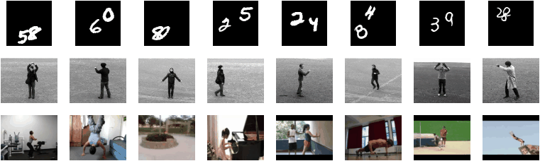

## Folded Recurrent Neural Networks

Here we provide the code for Folded Recurrent Neural Networks, a type of recurrent auto-encoder with shared states between encoder and decoder. This allows for representation stratification, with the resulting model requiring less capacity on the deeper layers. It is also possible to use only the encoder or decoder during encoding and prediction, respectively. This results in computational and memory savings, and limits the propagation of prediction errors by avoiding the re-encoding of predictions. Due to this strategy, layers can be removed from an already trained model. This facilitates the analysis of the contribution to the final predictions made by each layer. It also serves as mechanism for reducing the size of the final models. This code applies fRNN to future video prediction, as explained in the following paper:

<ARXIV, PENDING PUBLICATION>

This repository also implements the RLadder baseline presented in the paper. This baseline uses an equivalent topology that makes use of bridge connections instead of directly sharing the states. The other methods in the comparison also made their code publicly available.

### DATASETS & MODELS
The models for each dataset are saved inside "./model/<dataset>/". Each model has a main file, one for the fRNN model
named "model_frnn.py" and one for the RLadder baseline, named "main_rladder.py". These files specify the paths where
to find the pre-processed data and save the trained models, as well as the training parameters:

- Number of training terations (batches)
- Batch size
- Device to use
- Topology parameters
- Data loading and augmentation parameters

The folder for each dataset also contains a dataset-specific loader to feed the network ("loader.py") and a data
preprocessing script ("preprocess.py"). The former should only be modified if you plan on using the code on other
datasets not considered here. The later should be manually run in order to prepare the dataset before trying
to train any model. In the case of Moving MMNIST, the preprocessing script will download the necessary files before
preprocessing. For KTH and UCF101 the script expects the uncompressed datasets to be already present. These can be found in the following websites:

KTH - http://www.nada.kth.se/cvap/actions/  
UCF101 - http://crcv.ucf.edu/data/UCF101.php

### MAIN FILES

Each model has a main file associated. They are all identical, changing only the imported model file. By default, the
model will train, test and analyse the results of the model. Each step can be executed independently by commenting the
other actions, as intermediate results are saved to disk. There is also a "run" function commented by default. This
function allows you to extract direct predictions from the model, as well as to plot the results as they are obtained.
